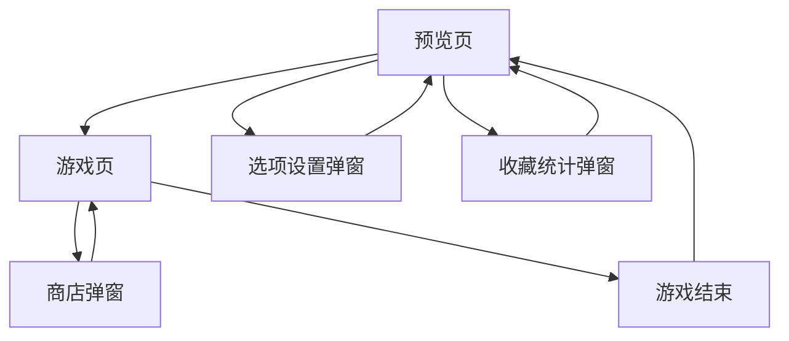

# Balatro 纯前端版本 - 产品需求文档

## 1. 产品概述

Balatro 是一款结合扑克牌型和 Roguelike 元素的策略卡牌游戏，玩家通过组合扑克牌型获得分数，使用小丑牌增强效果，在逐渐增加的难度中挑战更高分数。

本项目旨在开发一个纯前端版本的 Balatro 游戏，保留核心玩法机制的同时，提供流畅的 Web 游戏体验。目标是创造一个可在浏览器中运行的完整游戏，支持本地存档和跨设备游玩。

## 2. 核心功能

### 2.1 用户角色

| 角色 | 注册方式 | 核心权限 |
|------|----------|----------|
| 游戏玩家 | 无需注册，本地游玩 | 可进行游戏、保存进度、查看统计数据 |

### 2.2 功能模块

我们的 Balatro 游戏包含以下主要页面：

1. **预览页（主菜单）**：游戏标题、开始游戏按钮、三个功能弹窗入口（开始游戏、选项设置、收藏统计）
2. **游戏页**：左侧分数牌型区域、右侧打牌区域、商店弹窗、消耗牌区、牌组区、小丑牌区域

### 2.3 页面详情

| 页面名称 | 模块名称 | 功能描述 |
|----------|----------|----------|
| 预览页 | 游戏标题区 | 显示游戏 Logo 和版本信息，营造游戏氛围 |
| 预览页 | 主要按钮 | 开始游戏主按钮，进入游戏页面 |
| 预览页 | 选项设置弹窗 | 音频设置、显示设置、游戏偏好配置 |
| 预览页 | 收藏统计弹窗 | 历史最高分、游戏记录、成就系统 |
| 游戏页 | 左侧分数区 | 实时显示当前分数、目标分数、倍数计算过程 |
| 游戏页 | 左侧牌型区 | 自动识别当前选中牌型、显示基础分数和加成 |
| 游戏页 | 左侧选项区 | 显示剩余回合数、弃牌次数、确认出牌按钮 |
| 游戏页 | 右侧打牌区 | 显示当前手牌、支持拖拽选择、高亮可用牌型 |
| 游戏页 | 商店弹窗 | 显示可购买小丑牌、道具、刷新功能、资源管理 |
| 游戏页 | 消耗牌区 | 显示和管理消耗类卡牌 |
| 游戏页 | 牌组区 | 显示剩余牌组数量和牌组管理 |
| 游戏页 | 小丑牌区域 | 展示已装备小丑牌、显示效果描述、支持重新排序 |

## 3. 核心流程

### 主要游戏流程

1. **游戏开始**：玩家从预览页进入游戏页，系统初始化牌组和基础状态
2. **回合循环**：玩家在右侧打牌区选择手牌组成牌型，系统计算分数并应用小丑牌效果
3. **商店阶段**：回合间隙玩家可打开商店弹窗购买小丑牌或道具
4. **难度递增**：每轮游戏目标分数提高，挑战逐渐增加
5. **游戏结束**：未达到目标分数时游戏结束，返回预览页记录最终成绩

### 页面导航流程图

## 4. 用户界面设计

### 4.1 设计风格

- **主色调**：深蓝色 (#1a1a2e) 和金黄色 (#ffd700)，营造赌场氛围
- **辅助色**：红色 (#dc2626) 用于重要提示，绿色 (#16a34a) 用于成功状态
- **按钮风格**：圆角矩形按钮，带有渐变效果和悬停动画
- **字体**：主标题使用装饰性字体，界面文字使用清晰的无衬线字体
- **布局风格**：卡片式布局，顶部导航，响应式设计
- **图标风格**：扁平化设计，使用扑克牌和赌场相关的图标元素

### 4.2 页面设计概览

| 页面名称 | 模块名称 | UI 元素 |
|----------|----------|----------|
| 预览页 | 游戏标题区 | 大号金色标题字体，带有发光效果和动画 |
| 预览页 | 主要按钮 | 居中的大型开始游戏按钮，深蓝背景金色边框 |
| 预览页 | 功能弹窗 | 半透明遮罩的弹窗，包含设置和统计内容 |
| 游戏页 | 左侧信息区 | 垂直布局的分数、牌型、选项显示区域 |
| 游戏页 | 右侧打牌区 | 扇形排列的手牌，选中时上浮，支持拖拽交互 |
| 游戏页 | 小丑牌区域 | 水平排列的小丑牌，带有稀有度颜色边框 |
| 游戏页 | 商店弹窗 | 网格布局的商品卡片，悬停时显示详情 |
| 游戏页 | 其他区域 | 消耗牌、牌组等功能区域的紧凑布局 |

### 4.3 响应式设计

产品采用桌面优先的设计策略，同时适配移动设备。在移动端优化触摸交互，调整卡牌大小和按钮间距，确保良好的操作体验。支持横屏和竖屏两种模式，自动调整布局以适应不同屏幕尺寸。