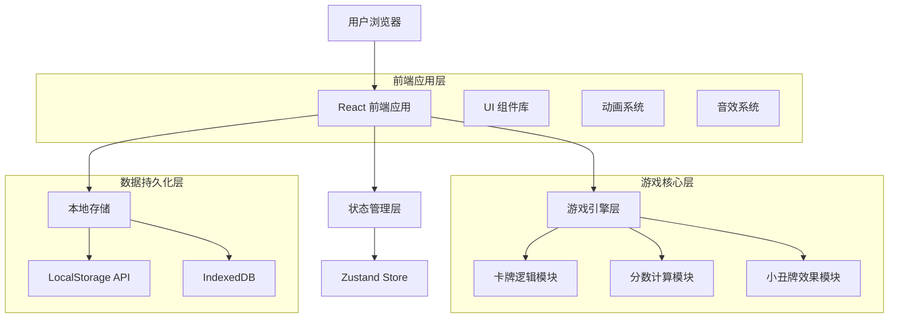
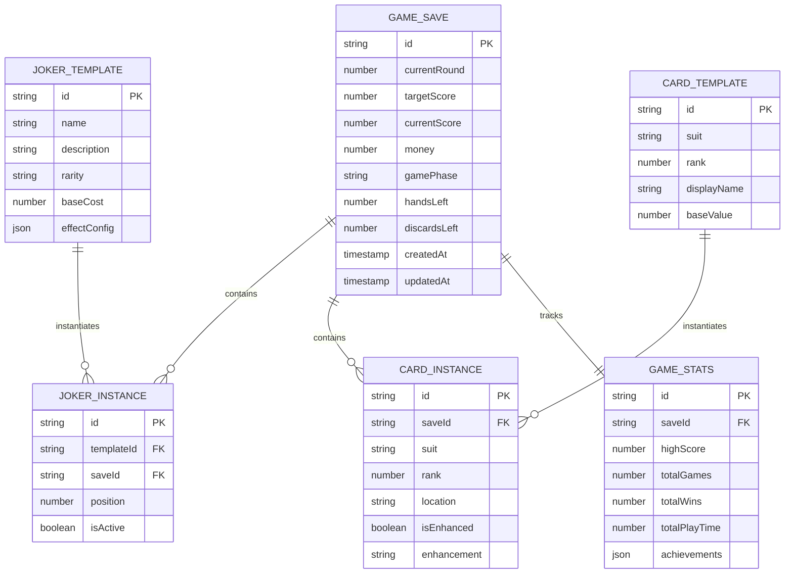

# Balatro 纯前端版本 - 技术架构文档

## 1. 架构设计



## 2. 技术描述

* **前端框架**：React\@18 + TypeScript\@5 + Vite\@5

* **状态管理**：Zustand\@4 + Immer\@10

* **样式方案**：Tailwind CSS\@3 + Headless UI\@1

* **动画库**：Framer Motion\@10 + React Spring\@9

* **音效处理**：Howler.js\@2

* **数据存储**：LocalStorage + IndexedDB (Dexie.js\@3)

* **构建工具**：Vite + TypeScript + ESLint + Prettier

* **部署平台**：Vercel

## 3. 路由定义

| 路由 | 用途 |
|------|------|
| / | 预览页（主菜单），游戏入口和导航，包含设置、统计弹窗 |
| /game | 游戏页，核心游戏玩法，包含商店弹窗和各功能区域 |

## 4. 核心模块设计

### 4.1 游戏状态管理

```typescript
// 游戏主状态接口
interface GameState {
  // 游戏基础状态
  gamePhase: 'menu' | 'playing' | 'shop' | 'gameOver';
  currentRound: number;
  targetScore: number;
  currentScore: number;
  money: number;
  
  // 卡牌相关
  deck: Card[];
  hand: Card[];
  selectedCards: Card[];
  discardPile: Card[];
  
  // 小丑牌系统
  jokers: Joker[];
  maxJokers: number;
  
  // 回合控制
  handsLeft: number;
  discardsLeft: number;
  
  // 商店状态
  shopItems: ShopItem[];
  shopRefreshCost: number;
}

// 卡牌接口
interface Card {
  id: string;
  suit: 'hearts' | 'diamonds' | 'clubs' | 'spades';
  rank: number; // 1-13 (A, 2-10, J, Q, K)
  isSelected: boolean;
  isEnhanced: boolean;
  enhancement?: Enhancement;
}

// 小丑牌接口
interface Joker {
  id: string;
  name: string;
  description: string;
  rarity: 'common' | 'uncommon' | 'rare' | 'legendary';
  cost: number;
  effect: JokerEffect;
  sellValue: number;
}

// 小丑牌效果接口
interface JokerEffect {
  type: 'multiplier' | 'additive' | 'conditional' | 'special';
  trigger: 'onScore' | 'onDiscard' | 'onDraw' | 'passive';
  value: number;
  condition?: (gameState: GameState) => boolean;
  apply: (score: number, gameState: GameState) => number;
}
```

### 4.2 牌型识别系统

```typescript
// 牌型枚举
enum HandType {
  HIGH_CARD = 'high_card',
  PAIR = 'pair',
  TWO_PAIR = 'two_pair',
  THREE_OF_A_KIND = 'three_of_a_kind',
  STRAIGHT = 'straight',
  FLUSH = 'flush',
  FULL_HOUSE = 'full_house',
  FOUR_OF_A_KIND = 'four_of_a_kind',
  STRAIGHT_FLUSH = 'straight_flush',
  ROYAL_FLUSH = 'royal_flush'
}

// 牌型配置
interface HandTypeConfig {
  name: string;
  baseChips: number;
  baseMultiplier: number;
  level: number;
  upgradeCost: number;
}

// 分数计算结果
interface ScoreResult {
  handType: HandType;
  baseScore: number;
  chips: number;
  multiplier: number;
  finalScore: number;
  jokerEffects: JokerEffectResult[];
}
```

### 4.3 游戏引擎核心

```typescript
class GameEngine {
  private gameState: GameState;
  private handEvaluator: HandEvaluator;
  private jokerManager: JokerManager;
  private scoreCalculator: ScoreCalculator;

  // 初始化游戏
  initializeGame(): void;
  
  // 发牌
  dealCards(count: number): Card[];
  
  // 选择卡牌
  selectCard(cardId: string): void;
  
  // 出牌
  playHand(): ScoreResult;
  
  // 弃牌
  discardCards(cardIds: string[]): void;
  
  // 进入商店
  enterShop(): void;
  
  // 购买物品
  buyItem(itemId: string): boolean;
  
  // 下一轮
  nextRound(): void;
  
  // 游戏结束检查
  checkGameOver(): boolean;
}
```

## 5. 数据模型

### 5.1 数据模型定义



### 5.2 本地存储结构

```typescript
// LocalStorage 存储的游戏设置
interface GameSettings {
  masterVolume: number;
  sfxVolume: number;
  musicVolume: number;
  animationSpeed: 'slow' | 'normal' | 'fast';
  autoSave: boolean;
  showTutorial: boolean;
  language: 'zh-CN' | 'en-US';
}

// IndexedDB 存储的游戏存档
interface GameSave {
  id: string;
  name: string;
  gameState: GameState;
  statistics: GameStatistics;
  createdAt: Date;
  updatedAt: Date;
  isAutoSave: boolean;
}

// 游戏统计数据
interface GameStatistics {
  highScore: number;
  totalGames: number;
  totalWins: number;
  totalPlayTime: number; // 毫秒
  averageScore: number;
  bestRound: number;
  achievements: Achievement[];
  jokerStats: Record<string, JokerUsageStats>;
}
```

## 6. 性能优化策略

### 6.1 渲染优化

* **虚拟化列表**：使用 React-Window 优化大量卡牌的渲染

* **组件懒加载**：使用 React.lazy 和 Suspense 分割代码

* **状态优化**：使用 useMemo 和 useCallback 减少不必要的重渲染

* **动画优化**：使用 CSS Transform 和 GPU 加速，避免布局重排

### 6.2 内存管理

* **对象池**：复用卡牌和效果对象，减少垃圾回收

* **图片预加载**：预加载游戏资源，使用 Service Worker 缓存

* **状态清理**：及时清理不需要的游戏状态和事件监听器

### 6.3 数据优化

* **增量保存**：只保存变化的游戏状态，减少存储开销

* **压缩存储**：使用 LZ-string 压缩存档数据

* **批量操作**：合并多个状态更新，减少重渲染次数

## 7. 部署和构建

### 7.1 构建配置

```typescript
// vite.config.ts
export default defineConfig({
  plugins: [react(), typescript()],
  build: {
    target: 'es2020',
    outDir: 'dist',
    sourcemap: false,
    minify: 'terser',
    rollupOptions: {
      output: {
        manualChunks: {
          vendor: ['react', 'react-dom'],
          game: ['./src/game-engine'],
          ui: ['./src/components']
        }
      }
    }
  },
  optimizeDeps: {
    include: ['react', 'react-dom', 'zustand']
  }
});
```

### 7.2 部署策略

* **静态部署**：使用 Vercel 进行自动化部署

* **CDN 加速**：静态资源通过 CDN 分发

* **PWA 支持**：添加 Service Worker 支持离线游玩

* **版本管理**：使用语义化版本控制和自动化发布

